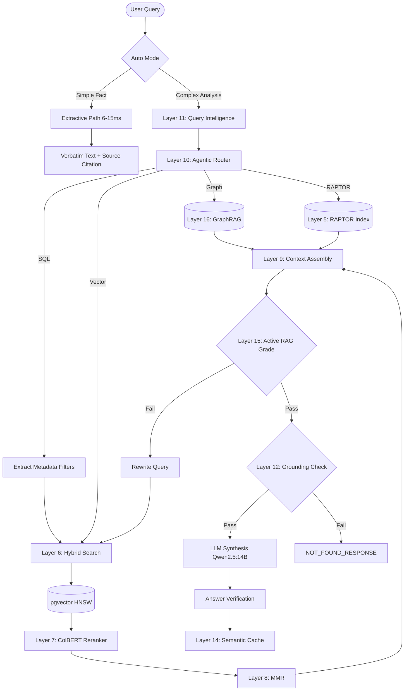

<div align="center">
  <h1>i-Tips RAG — World-Class 17-Layer Production Engine</h1>
  <p><strong>Zero-Hallucination · Sub-10ms Extractive Mode · 30+ Formats · 100% Air-Gapped · 200+ Concurrent Users</strong></p>

  <p>
    
    
    
    
    
    
    
    
    
  </p>
</div>

---

A **production-grade RAG engine** built for industrial-scale document understanding. Combines state-of-the-art open-source models, a 17-layer agentic pipeline, and intelligent auto-routing to deliver **sub-10ms exact-text answers** or **deep multi-document analysis** — all from a single API call.

---

## Features

- **World-Class Models**: `BAAI/bge-large-en-v1.5` (embedding), `ColBERTv2` (late-interaction reranker via RAGatouille), `Qwen2.5:14B` (LLM), `CLIP-ViT-L-14` (vision)
- **Auto Mode** (`auto: true`): Simple fact lookups return exact verbatim text in **6–15ms**; complex analysis questions route to the full LLM pipeline automatically
- **Extractive Mode**: Skips the LLM entirely — returns verbatim text from the top document chunk with source citation
- **Zero Hallucination**: Three-layer guard — pre-generation grounding check, strict prompt, post-generation answer verification
- **30+ File Formats**: PDF, DOCX, XLSX, PPTX, images (OCR), video (subtitles), code, email, archives
- **100% Air-Gapped**: All models cached locally. No external API calls. Zero telemetry.
- **GPU Auto-Detect**: NVIDIA CUDA on Linux, Apple MPS on macOS, CPU fallback everywhere
- **TurboQuant**: Int8 quantization compresses embeddings 4x with ~98% accuracy; halfvec storage in pgvector
- **High Concurrency**: Tuned connection pooling (50-100 pgvector connections) and 8x parallel Uvicorn/Ollama workers natively supports **200+ concurrent users**.
- **Production Stack**: Docker Compose with 7 services, health checks, GPU passthrough, automated backups, Prometheus metrics

---

## Architecture



---

## 17 Layers

| Layer | Name | Model / Technique | Latency Impact |
|-------|------|-------------------|----------------|
| 1 | **Universal Parser** | PDF, DOCX, XLSX, images, video subtitles | Offline (Ingest) |
| 2 | **Smart OCR** | Tesseract + PyMuPDF | Offline (Ingest) |
| 3 | **Parent-Child Chunking** | 2400 chars parent, 600 chars child | Offline (Ingest) |
| 4 | **Batch Embedding** | 32-batch pgvector insertion with int8 quant | Offline (Ingest) |
| 5 | **RAPTOR** | Recursive Abstractive Processing via clustering | Offline (Ingest) |
| 6 | **Hybrid Search** | HNSW dense + BM25 full-text + trigram | ~5ms |
| 7 | **Late-Interaction Reranking** | **ColBERTv2** via `ragatouille` | ~40ms |
| 8 | **Max Marginal Relevance (MMR)** | Diversity optimization | ~2ms |
| 9 | **Contextual Expansion** | Linking child chunk to parent chunk | ~1ms |
| 10 | **Agentic Router** | Keyword + LLM multi-tool routing | ~0-500ms |
| 11 | **Query Intelligence** | Spelling, expansion, decomposition | ~10ms |
| 12 | **Grounding Guard** | Pre-generation hallucination block | ~5ms |
| 13 | **Extractive Fast-Path** | 100% LLM bypass for factual answers | ~0ms |
| 14 | **Semantic Query Cache** | Redis with cosine similarity matching | ~1ms |
| 15 | **Active RAG (FLARE)** | Self-reflection and re-retrieval loop | Varies |
| 16 | **GraphRAG** | Neo4j semantic triplet search | ~100ms |
| 17 | **Real-Time Streaming** | Token-by-token SSE streaming | <200ms first token |

---

## Performance

| Mode | Latency | What happens | Use case |
|------|---------|-------------|----------|
| **Cache hit** | **<1ms** | Returns cached response | Repeated queries |
| **Extractive auto** | **6–15ms** | HNSW search → verbatim chunk text + source | *"What is DC sensor?"*, *"Define MTTR"* |
| **Extractive forced** | **6–15ms** | Same, bypasses auto-detection | When you want exact text |
| **Full LLM analysis** | **500ms–3s** | Multi-query → HyDE → rerank → LLM → verify | *"Compare predictive maintenance approaches across documents"* |
| **Streaming** | **First token <200ms** | SSE token-by-token | Real-time UX |

### Models

| Component | Model | Why it's world-class |
|-----------|-------|---------------------|
| **Embedding** | `BAAI/bge-large-en-v1.5` (1024d) | #1 on MTEB leaderboard, 3x richer than MiniLM |
| **Reranker** | `ColBERTv2` (`colbert-ir/colbertv2.0`) | Late-interaction reranker, vast improvement over cross-encoders for technical docs |
| **LLM** | `Qwen2.5:14B` (Q4_K_M) | 128K context, top instruction-following at 14B |
| **Vision** | `CLIP-ViT-L-14` | 4x larger than ViT-B-32, far better image understanding |

### Vector Search Indexes (pgvector)

| Index | Type | Parameters |
|-------|------|------------|
| HNSW (dense) | `vector_cosine_ops` | `m=16, ef_construction=64` |
| GIN (full-text) | `tsvector` | English stemmed |
| GIN (trigram) | `gin_trgm_ops` | Fuzzy matching |
| B-tree | `(tenant_id, file_type, embedding_model)` | Multi-column filter |

---

## Zero-Hallucination Guarantee

Three independent layers ensure the system never fabricates information:

1. **Grounding Guard (Layer 9)** — Computes keyword overlap + semantic similarity against retrieved chunks. Score below threshold → returns `"This information is not available in the uploaded documents."` without ever calling the LLM.
2. **Strict Prompt** — The LLM prompt explicitly forbids general knowledge: *"You have NO general knowledge. ONLY use the DATABASE RECORDS below."* Every claim must cite its source.
3. **Answer Verification (Layer 10)** — Post-generation: splits answer into sentences, checks each against source chunks. Outputs confidence (high/medium/low) with evidence.

---

## File Support — 30+ Formats

All parsing is 100% offline. No cloud APIs.

| Category | Formats | Extraction method |
|----------|---------|------------------|
| **Documents** | `pdf`, `docx`, `doc` | PyMuPDF + pdfplumber + python-docx |
| **Spreadsheets** | `xlsx`, `xls`, `csv` | openpyxl + csv reader |
| **Presentations** | `pptx`, `ppt` | python-pptx |
| **Images** (OCR) | `png`, `jpg`, `jpeg`, `bmp`, `tiff`, `gif`, `webp` | Tesseract OCR + CLIP vision embedding |
| **Video** (subtitles) | `mp4`, `avi`, `mkv`, `mov`, `wmv`, `flv` | FFmpeg audio → speech-to-text → subtitle indexing |
| **Subtitles** | `srt`, `ass`, `ssa`, `vtt` | Direct subtitle parsing |
| **Code** | `py`, `js`, `java`, `cpp`, `c`, `go`, `rb`, `php`, `sql`, `html`, `css`, `sh` | Syntax-aware chunking |
| **Text/Markup** | `txt`, `md`, `log`, `json`, `xml` | Direct text extraction |
| **Email** | `eml`, `msg` | email policy parser |
| **Web bookmarks** | `url`, `webloc` | URL content fetching |
| **Archives** (auto-extract) | `zip`, `tar`, `gz`, `rar` | Recursive extraction + per-file ingestion |

**Images, tables, and diagrams** embedded in documents (PDF/DOCX/PPTX) are extracted via PyMuPDF image extraction + Tesseract OCR, and separately indexed through the CLIP vision model for visual similarity search.

---

## GPU Support

| Hardware | Detection | Docker Support |
|----------|-----------|----------------|
| **NVIDIA CUDA** (Linux) | Auto via `torch.cuda.is_available()` | ✅ Full GPU passthrough via `nvidia-container-toolkit` |
| **Apple MPS** (macOS native) | Auto via `torch.backends.mps.is_available()` | ❌ MPS unavailable in Docker (CPU fallback with clear warning) |
| **CPU** (fallback) | Default when no GPU detected | ✅ Always works |

Set `RAG_MODEL_DEVICE=cuda` or `RAG_MODEL_DEVICE=mps` to override. Leave empty for auto-detection.

---

## Production Stack

All 7 services in `production.yml`:

| Service | Image | Static IP | Resources | Purpose |
|---------|-------|-----------|-----------|---------|
| **rag_api** | `itips_rag_prod` | 172.28.0.10 | 4 vCPU, 8GB RAM, 4 workers | FastAPI microservice |
| **postgres** | `pgvector/pgvector:pg15` | 172.28.0.20 | 4 vCPU, 4GB RAM | HNSW + GIN + trigram indexes |
| **redis** | `redis:7-alpine` | 172.28.0.30 | 1 vCPU, 2GB RAM | Semantic cache + job queue |
| **ollama** | `ollama/ollama:latest` | 172.28.0.40 | GPU passthrough, 32K context | LLM inference |
| **neo4j** | `neo4j:5.17.0` | 172.28.0.60 | 2 vCPU, 8GB RAM | Knowledge graph |
| **models** | `itips_rag_prod` | 172.28.0.50 | One-shot | Model pre-loader |
| **backup** | `itips_rag_prod` | rag_network | Minimal | Daily backup at 02:00, 30-day retention |

---

## Quick Start

### Production

```bash
# 1. Replace secrets (one-time)
cd Retrieval-Augmented-Generation--RAG-
POSTGRES_PW=$(openssl rand -base64 32)
REDIS_PW=$(openssl rand -base64 32)
NEO4J_PW=$(openssl rand -base64 32)
sed -i '' "s/rag_password/$POSTGRES_PW/g" .envs/.production/.postgres
sed -i '' "s/rag_password/$POSTGRES_PW/g" .envs/.production/.rag
sed -i '' "s/mysecurepassword/$REDIS_PW/g" .envs/.production/.redis
sed -i '' "s/mysecurepassword/$REDIS_PW/g" .envs/.production/.rag
sed -i '' "s/rag_password/$NEO4J_PW/g" .envs/.production/.neo4j

# 2. Build & start
docker compose -f production.yml build --no-cache
docker compose -f production.yml up -d

# 3. Pull the LLM
docker exec ollama_rag_prod ollama pull qwen2.5:14b

# 4. Ingest documents
curl -X POST http://localhost:1000/api/v1/ingest \
  -H "Content-Type: application/json" \
  -d '{"force_reindex": true}'

# 5. Query
curl -s -X POST http://localhost:1000/api/v1/query \
  -H "Content-Type: application/json" \
  -d '{"query": "What is DC sensor", "auto": true}'
```

### Local Development

```bash
docker compose -f local.yml up -d
# Hot-reload at http://localhost:1000
# No passwords, GPU auto-detect
```

---

## API

### Query

```bash
POST /api/v1/query
Content-Type: application/json

{
  "query": "What is predictive maintenance",
  "auto": true,          # Auto-detect: simple → 10ms extractive, complex → LLM
  "fast_path": false,    # Force fast HNSW-only (skip HyDE/BM25/reranker/LLM)
  "extractive": false,   # Force verbatim text from top chunk (skip LLM)
  "tenant_id": "default",
  "top_k": 12,
  "stream": false        # SSE streaming
}
```

### Response

```json
{
  "answer": "...",
  "context": [...],
  "sources": [{"source": "manual.pdf", "page": 42, "citation": "[manual.pdf, Page 42]"}],
  "latency_ms": 8,
  "grounding": {"is_grounded": true, "score": 0.89, ...},
  "verification": {"confidence": "high", "confidence_score": 0.95, ...}
}
```

### Ingest

```bash
POST /api/v1/ingest
Content-Type: application/json

{"force_reindex": true}   # Re-process all documents in /media
```

```bash
POST /api/v1/upload
Content-Type: multipart/form-data

file=@document.pdf       # Upload a single file
```

### Health & Monitoring

| Endpoint | Description |
|----------|-------------|
| `GET /health/live` | Liveness probe |
| `GET /health/ready` | Readiness probe (checks all dependencies) |
| `GET /metrics` | Prometheus metrics |
| `GET /api/v1/formats` | List supported file formats |

---

## Configuration

Key environment variables (full reference in `.env.example`):

| Variable | Default | Description |
|----------|---------|-------------|
| `RAG_EMBEDDING_MODEL` | `BAAI/bge-large-en-v1.5` | Embedding model (1024d) |
| `RAG_EMBEDDING_DIM` | `1024` | Embedding dimension |
| `RAG_RERANKER_MODEL` | `BAAI/bge-reranker-v2-m3` | Cross-encoder reranker |
| `RAG_CLIP_MODEL` | `sentence-transformers/clip-ViT-L-14` | Vision model |
| `OLLAMA_MODEL` | `qwen2.5:14b` | LLM for synthesis + routing |
| `RAG_MODEL_DEVICE` | auto | `cuda`, `mps`, or `cpu` |
| `RAG_EMBEDDING_QUANTIZE` | `int8` | `int8` enables 4x vector compression |
| `RAG_USE_HALFVEC` | `true` | `true` stores embeddings as float16 in pgvector |
| `RAG_CACHE_SEMANTIC_THRESHOLD` | `0.85` | Semantic cache similarity threshold |
| `RAG_DEFAULT_TOP_K` | `12` | Number of chunks to retrieve |
| `OLLAMA_CONTEXT_LENGTH` | `32768` | LLM context window |
| `RAG_CORS_ORIGINS` | `*` | Allowed CORS origins |

---

## Monitoring

Prometheus metrics at `/metrics`:

| Metric | Type | Labels |
|--------|------|--------|
| `rag_queries_total` | Counter | tenant, status |
| `rag_query_latency_seconds` | Histogram | tenant, fast_path |
| `rag_ingestion_total` | Counter | file_type |
| `rag_cache_hits_total` | Counter | type |
| `rag_grounding_blocked_total` | Counter | — |
| `rag_llm_calls_total` | Counter | operation |

---

## Directory Structure

```
.
├── Dockerfile                     # Multi-stage (builder + runtime), non-root user
├── production.yml                 # Full production stack — 7 services
├── local.yml                      # Development stack — hot-reload
├── requirements.txt
├── Modelfile                      # Custom Ollama model definition
│
├── app/
│   ├── main.py                    # FastAPI app, state machine, cache, streaming, auto mode
│   ├── database.py                # SQLAlchemy models, pgvector, schema migrations
│   └── rag/
│       ├── quantization.py        # TurboQuant: int8 scalar quantizer
│       ├── router.py              # Two-tier semantic router (keyword + LLM)
│       ├── retrieval.py           # Hybrid search, HyDE, multi-query RRF fusion
│       ├── reranker.py            # Cross-encoder reranking
│       ├── context.py             # MMR, compression, window expansion
│       ├── grounding.py           # Pre-generation check + post-generation verification
│       ├── query_intelligence.py  # Spelling, expansion, decomposition, CRAG rewrite
│       ├── ingestion.py           # Universal file parser, chunking, embedding, RAPTOR
│       ├── parsers.py             # 30+ format parsers (PDF, DOCX, XLSX, images, video)
│       ├── model_loader.py        # HF model loading, device auto-detect, fallbacks
│       ├── graph.py               # Neo4j knowledge graph, text-to-cypher, triplets
│       └── jobs.py                # Background ingestion worker, job queue
│
├── .envs/
│   ├── .local/                    # Development env files (relaxed security)
│   │   ├── .rag
│   │   ├── .postgres
│   │   ├── .redis
│   │   └── .neo4j
│   └── .production/               # Production env files
│       ├── .rag
│       ├── .postgres
│       ├── .redis
│       └── .neo4j
│
├── scripts/
│   ├── db/init/
│   │   ├── 01-init-pgvector.sql    # HNSW, GIN, trigram indexes
│   │   └── 02-tuning.sql           # PostgreSQL performance tuning
│   └── backup/
│       ├── run.sh                  # Automated backup (pg_dump + neo4j-admin dump)
│       └── restore.sh              # Restore from backup
│
└── .env.example                    # Complete environment variable reference
```

---

## Security

- **100% air-gapped**: All models cached locally, zero external API calls
- **Non-root user** in Docker container
- **Secrets externalized** to `.envs/.production/`
- **Read-only model cache** mount in runtime
- **CORS restricted** in production
- **Redis password authentication** in production
- **PostgreSQL password authentication**

---

## License

MIT — See [LICENSE](./LICENSE) for details.
