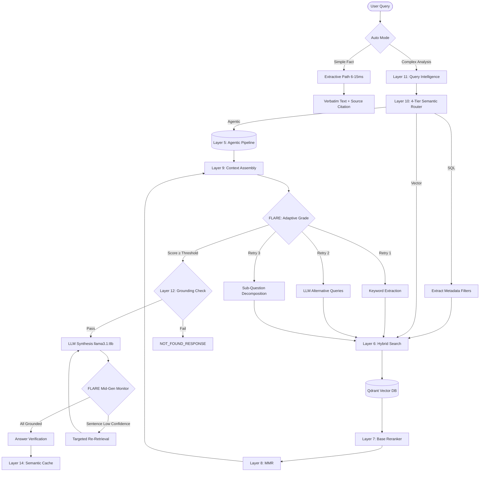

<div align="center">
  <h1>Enterprise Level RAG — NVIDIA Blueprint Architecture</h1>
  <p><strong>Developed & Owned by: Varun Srivastav</strong></p>
  <p><strong>Zero-Hallucination · Vision-Powered Extraction · Sub-10ms Extractive Mode · 100% Offline · NVIDIA Blueprint Aligned</strong></p>

  <p>
    
    
    
    
    
    
    
    
  </p>
</div>

---

A **production-grade RAG engine** built for industrial-scale document understanding. It strictly adheres to the **NVIDIA RAG Blueprint** concepts by integrating advanced Vision Language Models (VLMs) for flawless table and catalogue extraction, alongside deep, comprehensive text generation driven by inline citations and Chain-of-Thought (CoT) reasoning. Highly optimized to run fully offline within a strict **10GB VRAM** constraint.

---

## 🌟 Key Features

- **👁️ Llama 3.2 Vision Extractor**: Replaced legacy parsing techniques with an advanced Vision Language Model (`llama3.2-vision:11b`). It detects complex multi-column catalogue layouts, wiring diagrams, and dense nested tables, seamlessly converting them into structured Markdown for flawless retrieval.
- **📚 NVIDIA Blueprint Aligned Generation**:
  - **Comprehensive Synthesization**: Answers are deeply synthesized and logically structured, avoiding truncated or aggressive extractions.
  - **Inline Citations**: Every major claim generated by the LLM is automatically attributed with strict inline citations (e.g., `[Source: document.pdf, Page 4]`).
  - **Chain-of-Thought (CoT) Reasoning**: The system breaks down multi-hop logical tasks before emitting a final answer, preventing hallucination on complex engineering questions.
- **🔍 Zero-Token Exact Catalogue Lookup**: Pattern-based SQL `ILIKE` lookup via PostgreSQL integration bypasses the LLM and vector search for direct model/part number queries.
- **NeMo-Style Parent-Child Chunking**: Strict contextual preservation. Small precision chunks are indexed in Qdrant, but upon retrieval, the LLM receives the full encompassing parent block, completely eliminating linearization and context loss.
- **Highly Optimized Models**: `BAAI/bge-small-en-v1.5` (embedding, 384d), `BAAI/bge-reranker-base` (reranker), `llama3.1:8b` (LLM), and `llama3.2-vision:11b` (Vision).
- **Auto Mode** (`auto: true`): Simple fact lookups return exact verbatim text in **6–15ms**; complex analysis questions route to the full LLM pipeline automatically.
- **"One Topic, One PDF" Isolation**: The Self-Query Retriever dynamically extracts target document names/topics from the user query (e.g., "in the welding manual") and pushes strict SQL `ILIKE` and Qdrant metadata filters deep into the pipeline, guaranteeing 100% exact isolation with zero cross-contamination.
- **100% Offline & Air-Gapped**: Runs entirely locally on your machine or private server. No API keys, no internet connection required during inference.

---

## 🏗️ Architecture



---

## 🛡️ Deep Dive Processing Layers

The pipeline is split into **Ingestion**, **Retrieval & Routing**, and **Generation & Verification**.

### Phase 1: Universal Ingestion Engine
1. **Universal Parser**: Automatically detects file type from 30+ formats via IBM Docling.
2. **Vision Extraction**: Dense graphical tables and layouts are converted to images and piped through `llama3.2-vision:11b` to extract structured Markdown tables, completely circumventing traditional OCR limits.
3. **NeMo-Style Parent-Child Chunking**: Intelligent layout-aware splitting. Small child chunks are embedded for precise retrieval while linking directly to large, context-rich parent blocks.
4. **Text Embedding**: Encodes text and NL-serialized table rows via `bge-small-en-v1.5` (384d). Vectors stored in Qdrant.
5. **Agentic Plan-and-Execute**: A state-of-the-art LLM planner breaks complex queries into parallel sub-tasks and orchestrates retrieval.

### Phase 2: Retrieval & Intelligence
6. **Hybrid Search + Exact Lookups**: 
   - **① Exact SQL ILIKE** — catalogue/model number exact text match (highest priority)
   - **② Dense Vector** — Qdrant HNSW cosine search
   - **③ BM25 Postgres** — full-text search
7. **Base Reranking**: Re-scores top candidates using `bge-reranker-base`.
8. **MMR**: Maximum Marginal Relevance diversity pruning.
9. **Citation-Aware Context Assembly**: Formats and injects `[Source: filename, Page X]` directly into the context payload.
10. **4-Tier Semantic Router**: Analyzes query intent to route to Extractive/Vector/SQL pipelines.
11. **Query Intelligence**: Multi-query expansion, spelling correction, and **Self-Query Filter Extraction**.

### Phase 3: Generation & Anti-Hallucination
12. **Grounding Guard**: The pre-generation hallucination block ensuring zero invention of facts.
13. **Extractive Fast-Path**: Skips generation, delivers exact verbatim sentences in under 15ms.
14. **Semantic Query Cache**: Extremely fast Redis cosine-similarity cache.
15. **FLARE Active RAG**: Dynamic threshold retries for low confidence.
16. **Real-Time Streaming & Mid-Gen Verification**: Streams the answer token-by-token (SSE).

---

## ⚡ Performance

| Mode | Latency | What happens | Use case |
|------|---------|-------------|----------|
| **Cache hit** | **<1ms** | Returns cached response | Repeated queries |
| **Exact lookup** | **<5ms** | PostgreSQL SQL ILIKE search | Model / Catalogue numbers |
| **Extractive auto** | **6–15ms** | Qdrant search → verbatim chunk text | Simple facts |
| **Full LLM analysis** | **500ms–3s** | Multi-query → Vector → rerank → LLM | Analysis questions |

### Under the Hood

| Component | Model | VRAM Impact |
|-----------|-------|-------------|
| **Vision Extractor** | `llama3.2-vision:11b` | CPU/GPU dynamic loaded |
| **Embedding** | `BAAI/bge-small-en-v1.5` (384d) | ~150MB |
| **Reranker** | `BAAI/bge-reranker-base` | ~1.1GB |
| **LLM** | `llama3.1:8b` | ~4.8GB |

---

## 🚫 Zero-Hallucination Guarantee

Four independent layers ensure the system never fabricates information:

1. **Grounding Guard (Layer 12)**
2. **FLARE Active RAG (Layer 15)**
3. **Strict Prompt** — *"ZERO HALLUCINATION POLICY: If the exact answer is not explicitly stated, state: 'This information is not available'."*
4. **Answer Verification (Layer 16 post-gen)**

---

## 💻 GPU Support & VRAM Stability

Highly optimized to fit seamlessly inside a **10GB VRAM** GPU setup. Docker containers orchestrate automatic weight loading via Ollama seamlessly.

| Hardware | Detection | Docker Support |
|----------|-----------|----------------|
| **NVIDIA CUDA** (Linux) | Auto | Supported. |
| **Apple MPS** (macOS native) | Auto | CPU fallback in Docker |
| **CPU** (fallback) | Default | Supported |

Set `RAG_MODEL_DEVICE=cuda` or `RAG_MODEL_DEVICE=mps` to override. Leave empty for auto-detection.

---

## 🛠️ Production Stack

All 6 services operate within `production.yml` and self-manage via Docker Compose:

| Service | Container | Resources | Purpose |
|---------|-------|-----------|---------|
| **rag_api** | `itips_rag_prod` | 4 vCPU, 12GB RAM | FastAPI microservice |
| **qdrant** | `qdrant/qdrant` | 4 vCPU, 4GB RAM | Vector Indexing |
| **redis** | `redis:7-alpine` | 1 vCPU, 2GB RAM | Semantic cache |
| **ollama** | `ollama/ollama:0.3.14`| GPU passthrough | Hosts `llama3.1` & `llama3.2-vision` |
| **postgres**| `postgres:15-alpine`| 2 vCPU, 4GB RAM | Metadata & exact match DB |
| **models** | `itips_rag_prod` | One-shot | Model pre-loader script |

---

## 🚀 Quick Start

### The Smart Start Script (`start.sh`)

| Command | Action |
|---|---|
| `./start.sh production up` | Starts the production stack. |
| `./start.sh production update` | Instant fast-path update. |
| `./start.sh production build` | Forces a full image rebuild. |
| `./start.sh production clean` | Nuclear cleanup. |

### Production Setup

```bash
# 1. Replace secrets (one-time)
cd Retrieval-Augmented-Generation--RAG-
REDIS_PW=$(openssl rand -base64 32)

sed -i '' "s/mysecurepassword/$REDIS_PW/g" .envs/.production/.redis
sed -i '' "s/mysecurepassword/$REDIS_PW/g" .envs/.production/.rag

# 2. Build & start (This will auto-pull Ollama models)
chmod +x start.sh
./start.sh production up

# 3. Verify health
curl http://localhost:8000/health/ready

# 4. Ingest documents
curl -X POST http://localhost:8000/api/v1/ingest \
  -H "Content-Type: application/json" \
  -d '{"force_reindex": true}'

# 5. Query
curl -s -X POST http://localhost:8000/api/v1/query \
  -H "Content-Type: application/json" \
  -d '{"query": "What is DC sensor", "auto": true}'
```

---

## 🔐 Security

- **100% air-gapped**: All models cached locally, zero external API calls. Enforced via strict `RAG_AIRGAP_MODE=true` blocks at the parser layer.
- **Non-root user** in Docker container.
- **Secrets externalized** to `.envs/.production/`.

---

## 📄 License

MIT — See [LICENSE](./LICENSE) for details.
