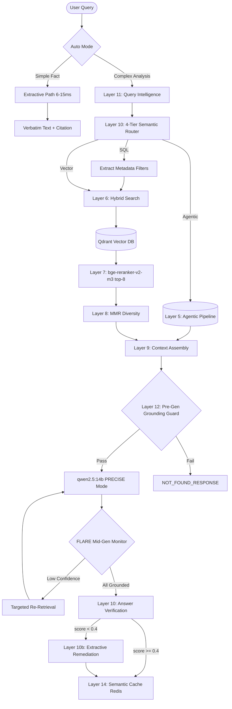

<div align="center">
  <h1>Enterprise Level RAG — NVIDIA Blueprint Architecture</h1>
  <p><strong>Developed &amp; Owned by: Varun Srivastav</strong></p>
  <p><strong>Zero-Hallucination · Verbatim Extraction · Sub-10ms Extractive Mode · 100% Offline · Air-Gapped</strong></p>

  <p>
    
    
    
    
    
    
    
    
    
  </p>
</div>

---

A **production-grade, 17-layer RAG engine** built for industrial-scale document understanding. Aligned with the **NVIDIA RAG Blueprint**: agentic plan-and-execute retrieval, NeMo-style parent-child chunking, hybrid search, ColBERT reranking, MMR diversity, FLARE active retrieval, and a 5-layer zero-hallucination system — **100% offline**, no API keys.

Optimized for a **16GB VRAM** GPU. Active VRAM: **~11GB** (LLM + embedding + reranker), ~5GB headroom.

---

## ⚡ Model Stack — 16GB VRAM

| Component | Model | VRAM | Notes |
|-----------|-------|------|-------|
| **LLM** | `qwen2.5:14b` Q4\_K\_M | **~8.5 GB** | Always loaded. Superior verbatim instruction following |
| **Embedding** | `BAAI/bge-large-en-v1.5` | **~1.3 GB** | 1024-dim · +41% MTEB vs bge-small · Always loaded |
| **Reranker** | `BAAI/bge-reranker-v2-m3` | **~1.2 GB** | SOTA cross-encoder · Always loaded |
| **Vision** | `llama3.2-vision:11b` | **~8.0 GB** | On-demand · LLM unloads first (KEEP\_ALIVE=5m) |
| **Subtotal (no vision)** | | **~11.0 GB** | 5 GB headroom |
| **Peak with vision** | | **~10.5 GB** | LLM unloaded, bge-large + reranker + vision active |

> **KV Cache**: `OLLAMA\_KV\_CACHE\_TYPE=q8\_0` saves ~40% KV VRAM → enables 64K context on 16GB.

### VRAM Tiering Guide

| GPU VRAM | LLM | Context | Embedding |
|---|---|---|---|
| 8 GB | `llama3.1:8b` | 32 768 | `bge-small-en-v1.5` (384d) |
| 12 GB | `gemma3:12b` | 49 152 | `bge-large-en-v1.5` (1024d) |
| **16 GB** | **`qwen2.5:14b`** | **65 536** | **`bge-large-en-v1.5` (1024d)** ← This |
| 24 GB | `qwen2.5:32b-q4_K_M` | 131 072 | `bge-large-en-v1.5` (1024d) |
| 48 GB | `llama3.3:70b-q4_K_M` | 131 072 | `bge-large-en-v1.5` (1024d) |

---

## 🌟 Key Features

- **👁️ Llama 3.2 Vision Extractor**: Detects multi-column catalogues, wiring diagrams, nested tables → structured Markdown.
- **🧠 qwen2.5:14b LLM**: 14B params, 128K native context. Much better verbatim rule-following than 8B models — directly improves hallucination score.
- **📚 NVIDIA Blueprint Generation**:
  - **CRITICAL CONSTRAINT Prompt**: Zero-hallucination block placed first, visually prominent, before all other directives.
  - **Verbatim Procedures**: Explicitly forbidden from rephrasing steps, part names, or software names.
  - **Inline Citations**: Every claim attributed with `[Source: doc.pdf, Page 4, Section: X]`.
  - **Chain-of-Thought (CoT)**: Multi-hop decomposition before emitting final answer.
- **🛡️ Layer 10b — Low-Confidence Remediation**: Post-generation verifier detects `confidence < 0.4` → silent re-generate with copy-paste-only extractive prompt. Closes the dead-end verification gap.
- **🔍 Zero-Token Exact Catalogue Lookup**: SQL `ILIKE` bypasses LLM + vector search for part/model numbers.
- **📦 NeMo-Style Parent-Child Chunking**: Child chunks in Qdrant; LLM receives full parent block.
- **🏎️ Auto Mode**: Simple facts → verbatim text in 6–15ms; complex analysis → full LLM pipeline.
- **🔒 100% Offline & Air-Gapped**: No API keys, no internet during inference.

---

## 🏗️ Architecture



---

## 🛡️ Zero-Hallucination System (5 Layers)

| Layer | Name | What it does |
|-------|------|-------------|
| **9** | Pre-Gen Grounding Guard | Blocks generation if chunk semantic score < threshold |
| **10** | Post-Gen Verifier | LLM-judged faithfulness score (0.0–1.0) |
| **10b** | Low-Confidence Remediation | Re-generates with copy-paste-only extractive prompt if score < 0.4 |
| **Prompt** | CRITICAL CONSTRAINT Block | Prominent box forbidding synonyms, paraphrasing, step reordering |
| **15** | FLARE Active RAG | Mid-generation re-retrieval when ungrounded sentence detected |

---

## 🛠️ Processing Layers

### Phase 1: Ingestion
1. **Universal Parser**: 30+ formats via IBM Docling.
2. **Vision Extraction**: Dense tables → `llama3.2-vision:11b` → Markdown. LLM unloads first.
3. **NeMo Parent-Child Chunking**: Small children indexed; large parent returned to LLM.
4. **Embedding**: `bge-large-en-v1.5` 1024d → Qdrant with halfvec compression.
5. **Agentic Plan-and-Execute**: LangGraph decomposes complex queries into parallel sub-tasks.

### Phase 2: Retrieval & Intelligence
6. **Hybrid Search**: ① SQL ILIKE (part numbers) → ② Dense Vector (Qdrant HNSW) → ③ BM25 Postgres → RRF fusion.
7. **Reranking**: `bge-reranker-v2-m3` cross-encoder, top-8 chunks (raised from 5).
8. **MMR**: Diversity pruning.
9. **Citation-Aware Context Assembly**: `[Source: file, Page X, Section: Y]` prepended to each chunk text for LLM anchoring. Chunk compression limit 3500 chars (raised from 2500).
10. **4-Tier Semantic Router**: Extractive / Vector / SQL / Agentic routing.
11. **Query Intelligence**: Multi-query expansion, Self-Query filter extraction, Industrial-aware HyDE.

### Phase 3: Generation & Anti-Hallucination
12. **Grounding Guard**: Pre-gen block.
13. **Extractive Fast-Path**: <15ms verbatim extraction.
14. **Semantic Query Cache**: Redis cosine-similarity.
15. **FLARE Active RAG**: Mid-generation re-retrieval.
16. **Answer Verification + Layer 10b**: Faithfulness scoring + extractive remediation.
17. **Real-Time Streaming**: SSE token streaming.

---

## ⚡ Performance

| Mode | Latency | Use case |
|------|---------|----------|
| **Cache hit** | **<1ms** | Repeated queries |
| **Exact lookup** | **<5ms** | Model / Catalogue numbers |
| **Extractive auto** | **6–15ms** | Simple facts |
| **Full LLM analysis** | **1–5s** | Analysis / multi-hop questions |

---

## 💻 GPU Support

| Hardware | Detection | Notes |
|----------|-----------|-------|
| **NVIDIA CUDA** (Linux) | Auto | Requires `nvidia-container-toolkit` in Docker |
| **Apple MPS** (macOS native) | Auto | CPU fallback in Docker — run natively for MPS |
| **CPU** | Default | Always works |

Set `RAG\_MODEL\_DEVICE=cuda` or `mps` to override. Leave blank for auto-detection.

---

## 🛠️ Production Stack

| Service | Container | Resources | Purpose |
|---------|-----------|-----------|---------|
| **rag_api** | `itips_rag_prod` | 4 vCPU · 16GB RAM | FastAPI 17-layer microservice |
| **qdrant** | `qdrant/qdrant` | 4 vCPU · 4GB RAM | Vector indexing |
| **redis** | `redis:7-alpine` | 1 vCPU · 2GB RAM | Semantic cache |
| **ollama** | `ollama/ollama` | GPU passthrough · 32GB RAM | `qwen2.5:14b` + `llama3.2-vision` |
| **postgres** | `postgres:15-alpine` | 2 vCPU · 4GB RAM | Metadata + BM25 + exact match |
| **models** | `itips_rag_prod` | One-shot init | Pulls Ollama models on first boot |

---

## 🚀 Quick Start

```bash
# 1. Set secrets (one-time)
REDIS_PW=P9aeyV+u0ekHXSriHoDVrLRR0kesYbkk1c06AlvKCyk=
sed -i '' "s/mysecurepassword//g" .envs/.production/.redis
sed -i '' "s/mysecurepassword//g" .envs/.production/.rag

# 2. Set 16GB VRAM model stack in production env
cat >> .envs/.production/.rag << EOF
OLLAMA_MODEL=qwen2.5:14b
OLLAMA_CONTEXT_LENGTH=65536
RAG_EMBEDDING_MODEL=BAAI/bge-large-en-v1.5
RAG_EMBEDDING_DIM=1024
RAG_RERANKER_MODEL=BAAI/bge-reranker-v2-m3
EOF

# 3. Build & start
chmod +x start.sh && ./start.sh production up

# 4. Re-ingest all documents (REQUIRED after embedding model upgrade)
# bge-small (384d) → bge-large (1024d) requires full re-index
curl -X POST http://localhost:1000/api/v1/ingest   -H "Content-Type: application/json"   -d '{"force_reindex": true}'

# 5. Query
curl -s -X POST http://localhost:1000/api/v1/query   -H "Content-Type: application/json"   -d '{"query": "What is DC sensor", "auto": true}'
```

> ⚠️ **Re-ingestion required** after upgrading from  (384d) to  (1024d). Different vector dimensions are incompatible.

---

## 🔐 Security

- **100% air-gapped**: All models cached locally. Zero external API calls during inference.
- **Non-root user** in Docker container.
- **Secrets externalized** to .

---

## 📄 License

MIT — See [LICENSE](./LICENSE) for details.
