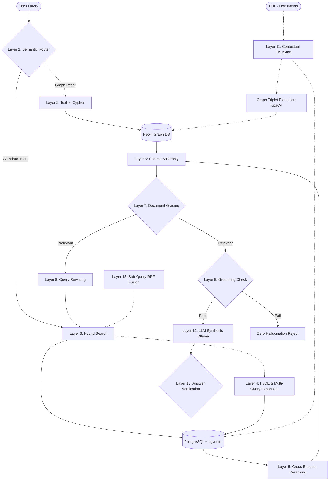

<div align="center">
  <h1>🚀 Advanced Agentic RAG</h1>
  <p><strong>A 13-Layer, 100% Air-Gapped, Graph-Augmented Retrieval System</strong></p>

  <p>
    
    
    
    
    
  </p>
</div>

---

## 🌟 Overview

The **Advanced Agentic RAG** is an enterprise-grade, state-of-the-art Retrieval-Augmented Generation pipeline. Designed with absolute privacy in mind, it operates **100% offline and air-gapped**. Zero bytes of data are sent to the internet. 

By combining traditional dense vector search with lexical search, Anthropic-style **Contextual Retrieval**, and **GraphRAG** (Knowledge Graphs), this system is engineered to achieve **Zero Hallucination** through strict pre-generation grounding and post-generation verification layers.

## 🧠 The 13-Layer Architecture

This system uses a highly optimized **State Machine Orchestrator** to fluidly route, retrieve, grade, rewrite, and generate answers based on user intent.



## ✨ Core Features

### 🛡️ 100% Air-Gapped Security
- **Local LLMs:** Powered by Ollama (`llama3`). No OpenAI or Claude API calls.
- **Local Embeddings:** PyTorch/HuggingFace `sentence-transformers` running directly on your CPU/GPU.
- **Local NLP:** `spaCy` dependency parsing for fast, offline Subject-Verb-Object (SVO) graph triplet extraction.

### 🕸️ GraphRAG & Contextual Retrieval
- **Neo4j Knowledge Graph:** Maps entities and relationships from documents to answer complex, multi-hop questions.
- **Anthropic-Style Contextual Retrieval:** Prepends an O(1) global document summary to every chunk before embedding, ensuring chunks never lose their surrounding context.

### 🔍 Advanced Retrieval Techniques
- **Hybrid Search:** Combines dense semantic search (`pgvector`) with lexical full-text search.
- **HyDE (Hypothetical Document Embeddings):** Generates a hypothetical answer to embed and search against.
- **Multi-Query Expansion:** Breaks complex queries into multiple sub-queries and fuses results using Reciprocal Rank Fusion (RRF).
- **Cross-Encoder Reranking:** Applies a heavy-weight `ms-marco` cross-encoder to rigorously re-rank the top retrieved chunks.

### 🚦 CRAG (Corrective RAG) State Machine
Instead of a rigid linear script, the pipeline uses an agentic **State Machine** that dynamically transitions between states:
1. `route`: Identifies if the query needs Graph DB or Vector DB.
2. `retrieve`: Executes Hybrid + HyDE + Multi-Query search.
3. `grade`: Uses the LLM to grade chunk relevance.
4. `rewrite`: If chunks are irrelevant, reformulates the user's query and loops back to retrieval.
5. `generate`: Synthesizes the final answer.

### 🎯 Zero Hallucination Policy (Layers 9 & 10)
- **Layer 9 (Pre-Generation):** Refuses to prompt the LLM if the retrieved chunks fail semantic/keyword overlap thresholds.
- **Layer 10 (Post-Generation):** Verifies the LLM's answer against the original source text to guarantee every claim is traceable.

## 🚀 Quick Start (Production)

To deploy the production-ready Docker stack:

```bash
# 1. Clone the repository
git clone https://github.com/varunsrivastav1999/Retrieval-Augmented-Generation--RAG-.git
cd Retrieval-Augmented-Generation--RAG-

# 2. Build and run the containers in detached mode
sudo docker compose -f production.yml up --build -d

# 3. View Logs
sudo docker compose -f production.yml logs -f
```

### Services Started:
- **FastAPI Backend:** `http://localhost:8000`
- **Neo4j Graph Database:** `http://localhost:7474` (Bolt: `7687`)
- **PostgreSQL (pgvector):** Port `5432`
- **Ollama:** `http://localhost:11434`

## 🛠️ Configuration
Adjust system behavior via the `.envs/.production/` files. The system will automatically download models (like `llama3`, `all-MiniLM-L6-v2`) on the first boot.

## 🤝 Contributing
Contributions are welcome! If you want to add support for new offline models, optimize the State Machine, or enhance the Graph extraction logic, please open a PR.
