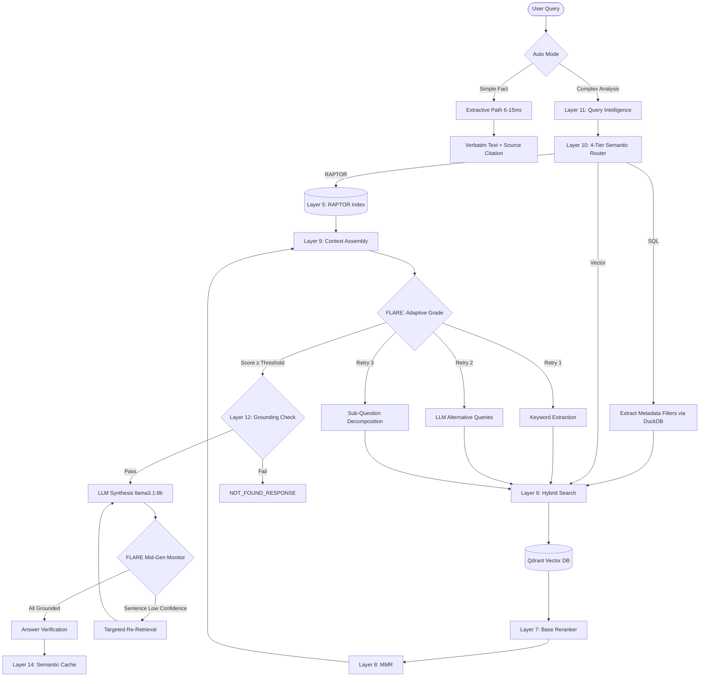

<div align="center">
  <h1>Enterprise Level RAG — World-Class 18-Layer Production Engine</h1>
  <p><strong>Developed & Owned by: Varun Srivastav</strong></p>
  <p><strong>Zero-Hallucination · 10GB VRAM Optimized · Sub-10ms Extractive Mode · 30+ Formats · Enterprise Complex Table QA</strong></p>

  <p>
    
    
    
    
    
    
    
    
    
    
  </p>
</div>

---

A **production-grade RAG engine** built for industrial-scale document understanding. Combines state-of-the-art open-source models, an 18-layer pipeline, and a dedicated **Table Reconstruction Engine** to deliver **near-human accuracy on complex PDF table QA**. Highly optimized to run fully offline within a strict **10GB VRAM** constraint.

---

## 🌟 Key Features

- **🌞 Table Reconstruction Engine v5.2**: Purpose-built `table_engine.py` for enterprise catalogue and technical document QA:
  - **Nested Header Resolution**: Reconstructs multi-level headers (e.g., "Dimensions > W") from PDF tables.
  - **Merged Cell Inheritance**: Bi-directional fill reconstructs rowspan/colspan merges that standard parsers flatten.
  - **Multi-Page Table Stitching**: Detects continuation tables across pages and merges into a single `RichTable`.
  - **1-Row-Per-Chunk Strategy**: Every data row is its own embedding chunk with full header context.
  - **Natural-Language Row Serialization**: Rows embedded as NL sentences for better semantic matching.
  - **HTML Table Renderer**: Context assembled as structured HTML for precise LLM column alignment.
  - **Section Title Tracking**: Every table tagged with its owning document section title.
- **🔍 Zero-Token Exact Catalogue Lookup**: Pattern-based SQL `ILIKE` lookup via PostgreSQL/DuckDB integration bypasses the LLM and vector search for model/part number queries.
- **Highly Optimized Models**: `BAAI/bge-small-en-v1.5` (embedding, 384d), `BAAI/bge-reranker-base` (reranker), `llama3.1:8b` (LLM).
- **Auto Mode** (`auto: true`): Simple fact lookups return exact verbatim text in **6–15ms**; complex analysis questions route to the full LLM pipeline automatically.
- **Extractive Mode**: Skips the LLM entirely — returns verbatim text from the top document chunk with source citation.
- **FLARE Active RAG (Layer 15)**: Three-tier retry (keyword extraction → LLM alternative queries → sub-question decomposition) with adaptive thresholds.
- **RAPTOR (Layer 5)**: Hierarchical summarization with UMAP + GMM clustering + LLM summarization.
- **"One Topic, One PDF" Isolation**: The Self-Query Retriever dynamically extracts target document names/topics from the user query (e.g., "in the welding manual") and pushes strict SQL `ILIKE` and Qdrant `MatchText` metadata filters deep into the pipeline, guaranteeing 100% exact isolation with zero cross-contamination.
- **Zero Hallucination**: Four-layer guard — pre-generation grounding check, strict citation prompt, mid-generation FLARE verification, post-generation verification.
- **30+ File Formats**: Powered by **IBM Docling** executing strictly in `TableFormerMode.ACCURATE` for flawless PDF/layout/math extraction. Fallbacks are disabled to ensure noisy data is never ingested. Light CPU OCR (Tesseract via Docling) used for scanned documents to save VRAM.
- **10GB VRAM Stability**: Fully stripped of heavy vision models and graph databases. The entire stack fits perfectly in consumer-grade GPUs without crashing.
- **Lightning Fast Vector Search**: Powered by **Qdrant** for sub-millisecond retrieval.

---

## 🏗️ Architecture



---

## 🛡️ 18 Processing Layers Deep Dive

The pipeline is split into **Ingestion** (Layers 0-5), **Retrieval & Routing** (Layers 6-11), and **Generation & Verification** (Layers 12-17).

### Layer 0: Table Reconstruction Engine *(v5.2)* — `app/rag/table_engine.py`
A dedicated table understanding module that executes between parsing and ingestion:
- **`SpanMatrix` Builder**: Resolves rowspan/colspan via pdfplumber bounding-box geometry.
- **Nested Header Resolver**: Builds `"Section > SubSection > Column"` paths for every data cell.
- **`MultiPageTableStitcher`**: Detects continuation tables and merges them across pages.
- **`RichTable`**: Structured data class.

### Phase 1: Universal Ingestion Engine
1. **Layer 1: Universal Parser**: Automatically detects file type from 30+ formats via Docling.
2. **Layer 2: CPU OCR Extraction**: Tesseract OCR via Docling extracts text from scanned PDFs without requiring massive VRAM allocations.
3. **Layer 3: Table-Aware 1-Row-Per-Chunk**: **1 row per chunk**. Each chunk carries: full resolved header path, section title, `{header: value}` JSON cells.
4. **Layer 4: Text Embedding**: Encodes text and NL-serialized table rows via `bge-small-en-v1.5` (384d). Vectors stored in Qdrant.
5. **Layer 5: RAPTOR Hierarchical Indexing**: Clusters vector embeddings via UMAP and Gaussian Mixture Models (GMM).

### Phase 2: Retrieval & Intelligence
6. **Layer 6: Hybrid Search + Exact Lookups**: 
   - **① Exact SQL ILIKE** — catalogue/model number exact text match (highest priority)
   - **② Dense Vector** — Qdrant HNSW cosine search
   - **③ BM25 Postgres** — table-noise-cleaned full-text search
7. **Layer 7: Base Reranking**: Re-scores top candidates using `bge-reranker-base`.
8. **Layer 8: MMR + Table Group Expansion**: MMR diversity pruning.
9. **Layer 9: Table-Aware Context Assembly**: Table chunks assembled into structured HTML tables for the LLM.
10. **Layer 10: 4-Tier Semantic Router**: Analyzes query intent to route to Extractive/Vector/SQL pipelines via DuckDB aggregation.
11. **Layer 11: Query Intelligence**: Multi-query expansion, spelling correction, and **Self-Query Filter Extraction** to enforce "One PDF" isolation rules prior to vector search.

### Phase 3: Generation & Anti-Hallucination
12. **Layer 12: Grounding Guard**: The pre-generation hallucination block.
13. **Layer 13: Extractive Fast-Path**: Skips generation, delivers exact verbatim sentences in under 15ms.
14. **Layer 14: Semantic Query Cache**: Extremely fast Redis cosine-similarity cache.
15. **Layer 15: FLARE Active RAG**: Dynamic threshold retries for low confidence.
16. **Layer 16: Real-Time Streaming & Mid-Gen Verification**: Streams the answer token-by-token (SSE) while validating sentence confidence in the background.

---

## ⚡ Performance

| Mode | Latency | What happens | Use case |
|------|---------|-------------|----------|
| **Cache hit** | **<1ms** | Returns cached response | Repeated queries |
| **Exact lookup** | **<5ms** | DuckDB SQL ILIKE search | Model / Catalogue numbers |
| **Extractive auto** | **6–15ms** | Qdrant search → verbatim chunk text | Simple facts |
| **Full LLM analysis** | **500ms–3s** | Multi-query → Vector → rerank → LLM | Analysis questions |

### Under the Hood

| Component | Model | VRAM Impact |
|-----------|-------|-------------|
| **Embedding** | `BAAI/bge-small-en-v1.5` (384d) | ~150MB |
| **Reranker** | `BAAI/bge-reranker-base` | ~1.1GB |
| **LLM** | `llama3.1:8b` | ~4.8GB |
| **Vector DB**| `Qdrant` | System RAM |
| **Meta DB** | `PostgreSQL` (pgvector) | System RAM |

---

## 🚫 Zero-Hallucination Guarantee

Four independent layers ensure the system never fabricates information:

1. **Grounding Guard (Layer 12)**
2. **FLARE Active RAG (Layer 15)**
3. **Strict Prompt** — *"You have NO general knowledge. ONLY use the DATABASE RECORDS below."*
4. **Answer Verification (Layer 16 post-gen)**

---

## 💻 GPU Support & VRAM Stability

Highly optimized to fit seamlessly inside a **10GB VRAM** GPU setup.

| Hardware | Detection | Docker Support |
|----------|-----------|----------------|
| **NVIDIA CUDA** (Linux) | Auto | Supported. |
| **Apple MPS** (macOS native) | Auto | CPU fallback in Docker |
| **CPU** (fallback) | Default | Supported |

Set `RAG_MODEL_DEVICE=cuda` or `RAG_MODEL_DEVICE=mps` to override. Leave empty for auto-detection.

---

## 🛠️ Production Stack

All 6 services in `production.yml`:

| Service | Image | Static IP | Resources | Purpose |
|---------|-------|-----------|-----------|---------|
| **rag_api** | `itips_rag_prod` | 172.28.0.10 | 4 vCPU, 12GB RAM | FastAPI microservice |
| **qdrant** | `qdrant/qdrant` | 172.28.0.20 | 4 vCPU, 4GB RAM | Vector Indexing |
| **redis** | `redis:7-alpine` | 172.28.0.31 | 1 vCPU, 2GB RAM | Semantic cache |
| **ollama** | `ollama/ollama:0.3.14` | 172.28.0.40 | GPU passthrough | llama3.1 8B |
| **postgres**| `postgres:15-alpine`| 172.28.0.30 | 2 vCPU, 4GB RAM | Metadata & exact match DB |
| **models** | `itips_rag_prod` | 172.28.0.50 | One-shot | Model pre-loader |

*(Note: Neo4j/GraphRAG has been completely removed to maintain the strict 10GB VRAM limit).*

---

## 🚀 Quick Start

### The Smart Start Script (`start.sh`)

| Command | Action |
|---|---|
| `./start.sh production up` | Starts the production stack. |
| `./start.sh production update` | Instant fast-path update. |
| `./start.sh production build` | Forces a full image rebuild. |
| `./start.sh production clean` | Nuclear cleanup. |

### Production Setup

```bash
# 1. Replace secrets (one-time)
cd Retrieval-Augmented-Generation--RAG-
REDIS_PW=$(openssl rand -base64 32)

sed -i '' "s/mysecurepassword/$REDIS_PW/g" .envs/.production/.redis
sed -i '' "s/mysecurepassword/$REDIS_PW/g" .envs/.production/.rag

# 2. Build & start
chmod +x start.sh
./start.sh production up

# 3. Verify health
curl http://localhost:1000/health/ready

# 4. Ingest documents
curl -X POST http://localhost:1000/api/v1/ingest \
  -H "Content-Type: application/json" \
  -d '{"force_reindex": true}'

# 5. Query
curl -s -X POST http://localhost:1000/api/v1/query \
  -H "Content-Type: application/json" \
  -d '{"query": "What is DC sensor", "auto": true}'
```

---

## ⚙️ Configuration Reference

Key environment variables:

| Variable | Default | Description |
|----------|---------|-------------|
| `RAG_EMBEDDING_MODEL` | `BAAI/bge-small-en-v1.5` | Embedding model (384d) |
| `RAG_RERANKER_MODEL` | `BAAI/bge-reranker-base` | Base reranker |
| `OLLAMA_MODEL` | `llama3.1:8b` | LLM for synthesis + routing |
| `GROUNDING_THRESHOLD` | `0.35` | Pre-generation guard |
| `OLLAMA_CONTEXT_LENGTH` | `32768` | Adjusted based on VRAM capacity |
| `RAG_DEFAULT_TOP_K` | `12` | Number of chunks to retrieve |

---

## 🔐 Security

- **100% air-gapped**: All models cached locally, zero external API calls. Enforced via strict `RAG_AIRGAP_MODE=true` blocks at the parser layer.
- **Non-root user** in Docker container.
- **Secrets externalized** to `.envs/.production/`.

---

## 📄 License

MIT — See [LICENSE](./LICENSE) for details.
