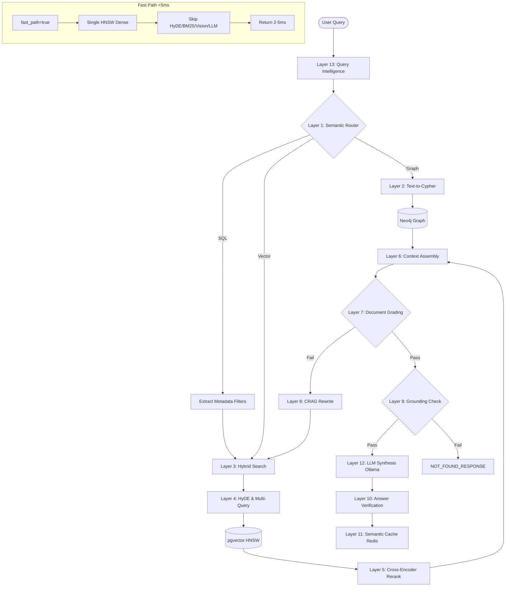

<div align="center">
  <h1>i-Tips RAG — 13-Layer Production Engine</h1>
  <p><strong>Zero-Hallucination Retrieval-Augmented Generation · Sub-5ms Fast Path · 100% Air-Gapped</strong></p>

  <p>
    
    
    
    
    
    
    
  </p>
</div>

---

## Architecture



## 13 Layers

| Layer | Name | File | Technique |
|-------|------|------|-----------|
| 0 | **TurboQuant** | `app/rag/quantization.py` | Int8 scalar quantization for 4x embedding compression; halfvec support for 2x pgvector storage reduction |
| 1 | **Semantic Router** | `app/rag/router.py` | Two-tier: keyword regex patterns (0ms, 90%+ queries) → Ollama LLM fallback for ambiguous queries |
| 2 | **Text-to-Cypher** | `app/rag/graph.py` | Natural language → Neo4j Cypher via Ollama; entity extraction via spaCy dependency parsing |
| 3 | **Hybrid Search** | `app/rag/retrieval.py` | HNSW dense + PostgreSQL ts_rank_cd full-text + trigram fuzzy + Vision CLIP + entity overlap boost, fused via RRF |
| 4 | **HyDE & Multi-Query** | `app/rag/retrieval.py` | Hypothetical Document Embedding via Ollama; sub-query expansion and decomposition with RRF fusion |
| 5 | **Cross-Encoder Reranker** | `app/rag/reranker.py` | `ms-marco-MiniLM-L-6-v2` cross-encoder; LexicalRerunner fallback for air-gapped mode |
| 6 | **Context Assembly** | `app/rag/context.py` | MMR diversity, compression, contextual window expansion (neighbor chunk fetching), citation attachment |
| 7 | **Document Grading** | `app/rag/grounding.py` | 40% keyword overlap + 60% semantic similarity scoring against configurable threshold |
| 8 | **CRAG Rewrite** | `app/rag/query_intelligence.py` | Reformulates query (strip question words → expand keywords) for second retrieval attempt |
| 9 | **Grounding Guard** | `app/rag/grounding.py` | Pre-generation rejection if combined score below threshold; adjustable for vague/short queries |
| 10 | **Answer Verification** | `app/rag/grounding.py` | Sentence-by-sentence token overlap against source chunks; outputs confidence (high/medium/low) + evidence |
| 11 | **Semantic Cache** | `app/main.py` | Redis-based with configurable cosine similarity threshold, tenant + corpus version scoping |
| 12 | **LLM Synthesis** | `app/main.py` | Ollama with strict grounding prompt, prefix stripping, streaming SSE support |
| 13 | **Query Intelligence** | `app/rag/query_intelligence.py` | Spelling correction (190+ industrial terms), synonym expansion, query decomposition, multi-hop chaining, text-to-SQL filter extraction |

## Pipeline

The orchestrator in `app/main.py` runs an **agentic state machine** (`route → retrieve → grade → rewrite → generate`) with a **fast-path bypass** that skips everything except a single HNSW query for sub-5ms latency.

```
                         ┌─────────────┐
                         │  /api/v1/query│
                         └──────┬──────┘
                                │
                     ┌──────────▼──────────┐
                     │  Layer 11: Cache Hit? │
                     └──────────┬──────────┘
                                │
                    ┌───────────┴───────────┐
                    ▼                       ▼
              ┌───────────┐         ┌───────────────┐
              │ Cache Hit │         │ fast_path=true │
              │  < 1ms    │         │  < 5ms HNSW   │
              └───────────┘         └───────┬───────┘
                                            ▼
                               ┌─────────────────────┐
                               │ Full State Machine   │
                               │ route → retrieve →   │
                               │ grade → rewrite(CRAG)│
                               │ → generate           │
                               └─────────────────────┘
                                            │
                               ┌────────────▼──────────┐
                               │ Layer 10: Verification │
                               └───────────────────────┘
                                            │
                               ┌────────────▼──────────┐
                               │ Layer 11: Save Cache   │
                               └───────────────────────┘
```

## Performance

| Path | Latency | When |
|------|---------|------|
| Cache hit | **1-3ms** | Repeated queries |
| Fast-path (HNSW only) | **2-8ms** | `fast_path=true` |
| Full pipeline (no cache) | **500ms-3s** | First-time / complex queries |

### Latency optimizations

- **Fast-path bypass**: `request.fast_path=true` → single HNSW query, skips HyDE/BM25/reranker/LLM entirely
- **Two-tier router**: Keyword matching (0ms) handles 90%+ queries; only ambiguous queries hit Ollama (~500ms)
- **HNSW indexes**: `m=16, ef_construction=64` for logarithmic vector search
- **Int8 quantization**: 4x embedding compression via `RAG_EMBEDDING_QUANTIZE=int8`; ~98% accuracy
- **Halfvec storage**: 2x pgvector storage reduction via `RAG_USE_HALFVEC=true`
- **Semantic cache**: Redis with configurable threshold (`RAG_CACHE_SEMANTIC_THRESHOLD=0.85`)
- **Async streaming**: SSE token-by-token response; client renders progressively

## Zero-Hallucination Guarantee

The system enforces a **three-layer guard** against hallucination:

1. **Grounding Check** (Layer 9) — Computes keyword + semantic overlap score. If below threshold, returns `"This information is not available in the uploaded documents."` without ever calling the LLM.
2. **Answer Verification** (Layer 10) — Splits the LLM-generated answer into sentences, checks each against source chunks. Returns confidence + evidence.
3. **Strict Prompt** — The LLM prompt explicitly forbids general knowledge: *"Act as a pure TEXT EXTRACTOR. You have NO general knowledge."*

## File Support

30+ formats via `app/rag/parsers.py`:

| Category | Formats |
|----------|---------|
| Documents | PDF, DOCX, ODT, RTF, TXT |
| Spreadsheets | XLSX, XLS, CSV, ODS |
| Presentations | PPTX, ODP |
| Images | PNG, JPG, JPEG, BMP, TIFF, WEBP |
| Video subtitles | SRT, VTT, ASS, SSA |
| Code | PY, JS, HTML, CSS, JSON, XML, YAML, TOML, MD, SQL |
| Email | EML, MSG |
| Web | URL, HTML |
| Archives | ZIP, TAR, TAR.GZ, TGZ |

## Production Stack

All 7 services defined in `production.yml`:

| Service | Image | Static IP | Purpose |
|---------|-------|-----------|---------|
| **rag_api** | `itips_rag_prod` | 172.28.0.10 | FastAPI 4 workers, 8GB RAM, health check |
| **postgres** | `pgvector/pgvector:pg15` | 172.28.0.20 | HNSW indexes, halfvec support, GIN full-text + trigram |
| **redis** | `redis:7-alpine` | 172.28.0.30 | 2GB semantic cache, password auth, append-only persistence |
| **ollama** | `ollama/ollama:latest` | 172.28.0.40 | GPU passthrough, health check on `ollama list` |
| **neo4j** | `neo4j:5.17.0-enterprise` | 172.28.0.60 | APOC plugins, 4GB heap, 2GB page cache |
| **models** | `itips_rag_prod` | 172.28.0.50 | One-shot pre-loader: pulls Ollama model + downloads HF models |
| **backup** | `itips_rag_prod` | rag_network | Daily pg_dump + neo4j-admin dump at 02:00, 30-day retention |

## Directory Structure

```
.
├── Dockerfile                     # Multi-stage (builder + runtime), non-root user
├── production.yml                 # Full production stack
├── local.yml                      # Development stack (hot-reload, relaxed limits)
├── requirements.txt
├── Modelfile                      # Custom Ollama model definition
│
├── app/
│   ├── main.py                    # FastAPI app, state machine, cache, streaming
│   ├── database.py                # SQLAlchemy models, pgvector, schema migrations
│   └── rag/
│       ├── quantization.py        # TurboQuant: int8 scalar quantizer
│       ├── router.py              # Two-tier semantic router (keyword + LLM)
│       ├── retrieval.py           # Hybrid search, HyDE, multi-query RRF fusion
│       ├── reranker.py            # Cross-encoder reranking
│       ├── context.py             # MMR, compression, window expansion
│       ├── grounding.py           # Pre-generation check + post-generation verification
│       ├── query_intelligence.py  # Spelling, expansion, decomposition, CRAG rewrite
│       ├── ingestion.py           # Universal file parser, chunking, embedding, RAPTOR
│       ├── parsers.py             # 30+ format parsers (PDF, DOCX, XLSX, images, video)
│       ├── model_loader.py        # HF model loading, device auto-detect, fallbacks
│       ├── graph.py               # Neo4j knowledge graph, text-to-cypher, triplets
│       └── jobs.py                # Background ingestion worker, job queue
│
├── .envs/
│   ├── .local/                    # Development env files (relaxed security)
│   │   ├── .rag
│   │   ├── .postgres
│   │   ├── .redis
│   │   └── .neo4j
│   └── .production/               # Production env files (CHANGE_ME_* placeholders)
│       ├── .rag
│       ├── .postgres
│       ├── .redis
│       └── .neo4j
│
├── scripts/
│   ├── db/init/
│   │   ├── 01-init-pgvector.sql    # HNSW, GIN, trigram indexes
│   │   └── 02-tuning.sql           # PostgreSQL performance tuning
│   └── backup/
│       ├── run.sh                  # Automated backup (pg_dump + neo4j-admin dump)
│       └── restore.sh              # Restore from backup
│
└── .env.example                    # Complete environment variable reference
```

## Deployment

### Production

```bash
# 1. Set secrets (one-time)
cd /path/to/project
POSTGRES_PW=$(openssl rand -base64 32)
REDIS_PW=$(openssl rand -base64 32)
NEO4J_PW=$(openssl rand -base64 32)

sed -i '' "s/CHANGE_ME_PASSWORD/$POSTGRES_PW/g" .envs/.production/.postgres
sed -i '' "s/CHANGE_ME_PASSWORD/$POSTGRES_PW/g" .envs/.production/.rag
sed -i '' "s/CHANGE_ME_REDIS_PASSWORD/$REDIS_PW/g" .envs/.production/.rag
sed -i '' "s/CHANGE_ME_REDIS_PASSWORD/$REDIS_PW/g" .envs/.production/.redis
sed -i '' "s/CHANGE_ME_NEO4J_PASSWORD/$NEO4J_PW/g" .envs/.production/.neo4j

# 2. Set your domain
sed -i '' "s|https://your-domain.com|https://yourdomain.com|g" .envs/.production/.rag

# 3. Build & start
docker compose -f production.yml build
docker compose -f production.yml up -d

# 4. Verify
docker compose -f production.yml ps
curl http://localhost:1000/health/ready
```

### Local Development

```bash
docker compose -f local.yml up -d
# Hot-reload enabled at http://localhost:1000
# No passwords, GPU auto-detect
```

## Configuration

All configuration via environment variables. Key settings:

| Variable | Default | Description |
|----------|---------|-------------|
| `RAG_EMBEDDING_QUANTIZE` | `none` | `int8` enables 4x vector compression |
| `RAG_USE_HALFVEC` | `false` | `true` stores embeddings as float16 in pgvector |
| `RAG_ENABLE_CONTEXT_EXPANSION` | `false` | Fetch neighboring chunks for context depth |
| `RAG_CACHE_SEMANTIC_THRESHOLD` | `0.85` | Lower = more cache hits, less precise |
| `RAG_DEFAULT_TOP_K` | `12` | Number of chunks to retrieve |
| `RAG_MODEL_DEVICE` | auto | `mps`, `cuda`, or `cpu` |
| `OLLAMA_MODEL` | `llama3` | Ollama model for synthesis + routing |
| `RAG_CORS_ORIGINS` | `*` | Comma-separated allowed origins |

## Monitoring

Prometheus metrics at `/metrics`:

| Metric | Type | Labels |
|--------|------|--------|
| `rag_queries_total` | Counter | tenant, status |
| `rag_query_latency_seconds` | Histogram | tenant, fast_path |
| `rag_ingestion_total` | Counter | file_type |
| `rag_cache_hits_total` | Counter | type |
| `rag_grounding_blocked_total` | Counter | — |
| `rag_llm_calls_total` | Counter | operation |

## Backup

Automated daily at 02:00 via `scripts/backup/run.sh`:

- **PostgreSQL**: `pg_dump -Fc` compressed custom format
- **Neo4j**: `neo4j-admin database dump`
- **Retention**: 30 days (configurable via `RETENTION_DAYS`)
- **Restore**: `scripts/backup/restore.sh [pg|neo4j|all] [file]`

## Security

- **100% air-gapped**: All models cached locally, no external API calls
- **Non-root user** in Docker container
- **Secrets externalized** to `.envs/.production/` with `CHANGE_ME_*` placeholders
- **Read-only model cache** mount in runtime
- **CORS restricted** in production
- **Redis password authentication** in production
- **PostgreSQL password authentication**
