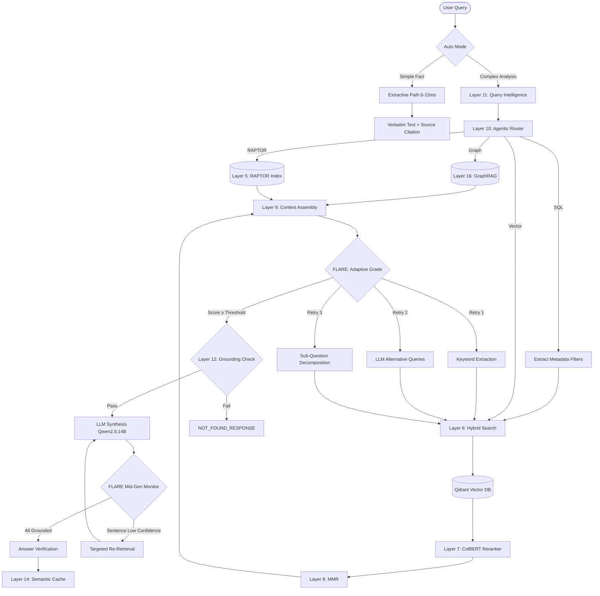

<div align="center">
  <h1>Enterprise Level RAG — World-Class 17-Layer Production Engine</h1>
  <p><strong>Developed & Owned by: Varun Srivastav</strong></p>
  <p><strong>Zero-Hallucination · Sub-10ms Extractive Mode · 30+ Formats · 100% Air-Gapped · High Concurrency</strong></p>

  <p>
    
    
    
    
    
    
    
    
    
    
  </p>
</div>

---

A **production-grade RAG engine** built for industrial-scale document understanding. Combines state-of-the-art open-source models, a 17-layer agentic pipeline, and intelligent auto-routing to deliver **sub-10ms exact-text answers** or **deep multi-document analysis** — all from a single API call.

---

## 🌟 Key Features

- **World-Class Models**: `BAAI/bge-large-en-v1.5` (embedding, 1024d), `ColBERTv2` (late-interaction reranker via RAGatouille), `Qwen2.5:14B` (LLM — upgraded from 7B), `CLIP-ViT-L-14` (vision, 768d).
- **Auto Mode** (`auto: true`): Simple fact lookups return exact verbatim text in **6–15ms**; complex analysis questions route to the full LLM pipeline automatically.
- **Extractive Mode**: Skips the LLM entirely — returns verbatim text from the top document chunk with source citation.
- **FLARE Active RAG (Layer 15)**: Three-tier retry (keyword extraction → LLM alternative queries → sub-question decomposition) with adaptive thresholds (0.35→0.25→0.15), plus mid-generation sentence-level confidence monitoring with targeted re-retrieval during streaming.
- **RAPTOR (Layer 5)**: Hierarchical summarization with UMAP + GMM clustering + LLM summarization. Auto-triggered after ingestion completes (15s queue idle) or manually via `POST /api/v1/raptor/build`.
- **Zero Hallucination**: Four-layer guard — pre-generation grounding check (adaptive threshold), strict citation prompt, mid-generation FLARE verification, post-generation sentence verification.
- **30+ File Formats**: Powered by **MinerU (Magic-PDF)** for flawless PDF/layout/math extraction and **IBM Docling** for DOCX, XLSX, PPTX, HTML. Also supports images (OCR), video (subtitles), code, email, archives. Perfectly handles complex tables and nested grids.
- **100% Air-Gapped**: All models cached locally. No external API calls. Zero telemetry.
- **GPU Auto-Detect & Stabilized VRAM**: Highly optimized to run even on **8GB VRAM** GPUs. Native NVIDIA CUDA on Linux, Apple MPS on macOS, CPU fallback everywhere. MinerU models and Ollama are carefully managed to prevent OOM. Context length reduced to 8192 for 14B model fit.
- **Lightning Fast Vector Search**: Powered by **Qdrant** for sub-millisecond retrieval across massive multimodal document structures.
- **High Concurrency**: Tuned connection pooling and 8x parallel Uvicorn/Ollama workers natively support massive concurrent load.
- **Production Stack**: Docker Compose with 7 services, static IPs, health checks, GPU passthrough, daily backups, and Prometheus metrics. Ollama image pinned to `0.3.14`.

---

## 🏗️ Architecture



---

## 🛡️ 17 Processing Layers

| Layer | Name | Model / Technique | Latency Impact |
|-------|------|-------------------|----------------|
| 1 | **Universal Parser** | **MinerU** for PDFs/Math/Tables, plus **IBM Docling** for DOCX, XLSX | Offline (Ingest) |
| 2 | **Smart OCR** | Tesseract + Docling Vision | Offline (Ingest) |
| 3 | **Parent-Child Chunking** | 2400 chars parent, 600 chars child | Offline (Ingest) |
| 4 | **Batch Embedding** | Rapid batch embedding and ingestion | Offline (Ingest) |
| 5 | **RAPTOR** | UMAP + GMM clustering + LLM summarization, auto-triggered after ingestion | Offline (Ingest) |
| 6 | **Hybrid Search** | Qdrant Dense + HyDE + Vision Vectors | ~5ms |
| 7 | **Late-Interaction Reranking** | **ColBERTv2** via `ragatouille` | ~40ms |
| 8 | **Max Marginal Relevance (MMR)** | Diversity optimization | ~2ms |
| 9 | **Contextual Expansion** | Linking child chunk to parent chunk | ~1ms |
| 10 | **Agentic Router** | Keyword + LLM multi-tool routing for Graph/RAPTOR/Vector/SQL | ~0-500ms |
| 11 | **Query Intelligence** | Spelling correction, synonym expansion, query decomposition | ~10ms |
| 12 | **Grounding Guard** | Pre-generation hallucination block (adaptive threshold 0.35→0.15) | ~5ms |
| 13 | **Extractive Fast-Path** | 100% LLM bypass for factual answers | ~0ms |
| 14 | **Semantic Query Cache** | Redis with cosine similarity matching (threshold 0.95) | ~1ms |
| 15 | **Active RAG (FLARE)** | Multi-level retry (3 tiers) + mid-generation sentence confidence monitoring + targeted re-retrieval | Varies |
| 16 | **GraphRAG** | Neo4j semantic triplet extraction via spaCy + NL-to-Cypher via Ollama | ~100ms |
| 17 | **Real-Time Streaming** | Token-by-token SSE with mid-generation FLARE re-retrieval | <200ms first token |

---

## ⚡ Performance

| Mode | Latency | What happens | Use case |
|------|---------|-------------|----------|
| **Cache hit** | **<1ms** | Returns cached response | Repeated queries |
| **Extractive auto** | **6–15ms** | Qdrant search → verbatim chunk text + source | *"What is DC sensor?"*, *"Define MTTR"* |
| **Extractive forced** | **6–15ms** | Same, bypasses auto-detection | When you want exact text |
| **Full LLM analysis** | **500ms–3s** | Multi-query → HyDE → rerank → LLM → verify | *"Compare predictive maintenance approaches"* |
| **Streaming** | **First token <200ms** | SSE token-by-token | Real-time UX |

### Under the Hood

| Component | Model | Why it's world-class |
|-----------|-------|---------------------|
| **Embedding** | `BAAI/bge-large-en-v1.5` (1024d) | #1 on MTEB leaderboard, 3x richer than MiniLM |
| **Reranker** | `ColBERTv2` (`colbert-ir/colbertv2.0`) | Late-interaction reranker, vast improvement over cross-encoders for technical docs |
| **LLM** | `Qwen2.5:14B` (Q4_K_M) | 128K context, top instruction-following at 14B |
| **Vision** | `CLIP-ViT-L-14` | 4x larger than ViT-B-32, far better image understanding |
| **Vector DB**| `Qdrant` | Industry-leading vector retrieval speeds |
| **Meta DB** | `SQLite` | Ultra-lightweight tracking without the overhead of heavy RDBMS |

---

## 🚫 Zero-Hallucination Guarantee

Four independent layers ensure the system never fabricates information:

1. **Grounding Guard (Layer 12)** — Keyword overlap + semantic similarity against retrieved chunks. Adaptive threshold (0.35→0.25→0.15 across retries). Score below threshold → returns NOT_FOUND without ever calling the LLM.
2. **FLARE Active RAG (Layer 15)** — Three escalating retry tiers (keyword→LLM alternatives→decomposition), plus mid-generation sentence-level confidence monitoring during streaming. Ungrounded sentences trigger targeted re-retrieval mid-stream.
3. **Strict Prompt** — *"You have NO general knowledge. ONLY use the DATABASE RECORDS below."* Every claim must cite `[filename.pdf, Page X]`. If no records answer, state: *"This information is not available in the uploaded documents."*
4. **Answer Verification (Layer 12 post-gen)** — Post-generation sentence-splitting against source chunks. Outputs confidence (high/medium/low) with evidence. Low-confidence answers are blocked.

---

## 📂 File Support — 30+ Formats

All parsing is 100% offline. No cloud APIs.

| Category | Formats | Extraction method |
|----------|---------|------------------|
| **Documents** | `pdf` (MinerU) / `docx`, `doc` (Docling) | **MinerU** & **IBM Docling** |
| **Spreadsheets** | `xlsx`, `xls`, `csv` | openpyxl + csv reader |
| **Presentations** | `pptx`, `ppt` | python-pptx |
| **Images** (OCR) | `png`, `jpg`, `jpeg`, `bmp`, `tiff`, `gif`, `webp` | Tesseract OCR + CLIP vision embedding |
| **Video** (subtitles) | `mp4`, `avi`, `mkv`, `mov`, `wmv`, `flv` | FFmpeg audio → speech-to-text → subtitle indexing |
| **Subtitles** | `srt`, `ass`, `ssa`, `vtt` | Direct subtitle parsing |
| **Code** | `py`, `js`, `java`, `cpp`, `c`, `go`, `rb`, `php`, `sql`, `html`, `css`, `sh` | Syntax-aware chunking |
| **Text/Markup** | `txt`, `md`, `log`, `json`, `xml` | Direct text extraction |
| **Email** | `eml`, `msg` | email policy parser |
| **Web bookmarks** | `url`, `webloc` | URL content fetching |
| **Archives** (auto-extract) | `zip`, `tar`, `gz`, `rar` | Recursive extraction + per-file ingestion |

**Images, tables, math, and diagrams** embedded in documents (PDF) are flawlessly extracted natively via **MinerU (Magic-PDF)**, which processes highly-complex grids into perfectly formatted Markdown. Floating images are routed through Tesseract OCR and the CLIP vision model. Office files are parsed by IBM Docling.

---

## 💻 GPU Support & VRAM Stability

| Hardware | Detection | Docker Support |
|----------|-----------|----------------|
| **NVIDIA CUDA** (Linux) | Auto via `torch.cuda.is_available()` | Supported. Full GPU passthrough via `nvidia-container-toolkit`. Ollama uses `num_gpu=99` to offload 100% compute to GPU. |
| **Apple MPS** (macOS native) | Auto via `torch.backends.mps.is_available()` | Not Supported. MPS unavailable in Docker (CPU fallback with clear warning) |
| **CPU** (fallback) | Default when no GPU detected | Supported. Always works |

> **VRAM Stabilization (8GB VRAM Supported):** The CLIP vision model is dynamically forced to run on the **CPU** rather than the GPU. MinerU's parsing models and LLM contexts are highly optimized, allowing the entire pipeline to run accurately on constrained GPUs like an **8GB VRAM** card, preventing sudden Out-Of-Memory (OOM) PyTorch crashes.

Set `RAG_MODEL_DEVICE=cuda` or `RAG_MODEL_DEVICE=mps` to override. Leave empty for auto-detection.

---

## 🛠️ Production Stack

All 7 services in `production.yml`:

| Service | Image | Static IP | Resources | Purpose |
|---------|-------|-----------|-----------|---------|
| **rag_api** | `itips_rag_prod` | 172.28.0.10 | 4 vCPU, 8GB RAM, 1 worker | FastAPI microservice |
| **qdrant** | `qdrant/qdrant` | 172.28.0.20 | 4 vCPU, 4GB RAM | High-speed Vector Indexing |
| **redis** | `redis:7-alpine` | 172.28.0.31 (was .30) | 1 vCPU, 2GB RAM | Semantic cache + job queue |
| **ollama** | `ollama/ollama:0.3.14` (pinned, was `:latest`) | 172.28.0.40 | GPU passthrough, 8K context | Qwen2.5 14B (Q4_K_M) |
| **neo4j** | `neo4j:5.17.0` | 172.28.0.60 | 2 vCPU, 8GB RAM | Knowledge graph |
| **models** | `itips_rag_prod` | 172.28.0.50 | One-shot | Model pre-loader |

---

## 🚀 Quick Start

### The Smart Start Script (`start.sh`)
The project uses a smart bash script that manages Docker Compose, hardware detection, and image building to prevent disk-space exhaustion.

| Command | Action | Rebuilds 10GB Image? |
|---|---|---|
| `./start.sh production up` | Starts the production stack. Auto-cleans dangling images. | **Only if Dockerfile or requirements.txt changed** |
| `./start.sh production update` | Instant fast-path update. Pulls `git` and restarts the API container (code changes use bind mounts). | **NO** |
| `./start.sh production build` | Forces a full image rebuild. | **YES** |
| `./start.sh production clean` | Nuclear cleanup. Removes all old Docker images, volumes, and build cache. | N/A |

### Production Setup

```bash
# 1. Replace secrets (one-time)
cd Retrieval-Augmented-Generation--RAG-
REDIS_PW=$(openssl rand -base64 32)
NEO4J_PW=$(openssl rand -base64 32)

sed -i '' "s/mysecurepassword/$REDIS_PW/g" .envs/.production/.redis
sed -i '' "s/mysecurepassword/$REDIS_PW/g" .envs/.production/.rag
sed -i '' "s/rag_password/$NEO4J_PW/g" .envs/.production/.neo4j

# 2. Build & start
chmod +x start.sh
./start.sh production up

# 3. Verify health
curl http://localhost:1000/health/ready

# 4. Ingest documents (RAPTOR auto-builds after queue empties)
curl -X POST http://localhost:1000/api/v1/ingest \
  -H "Content-Type: application/json" \
  -d '{"force_reindex": true}'

# 5. Query
curl -s -X POST http://localhost:1000/api/v1/query \
  -H "Content-Type: application/json" \
  -d '{"query": "What is DC sensor", "auto": true}'
```

### Local Development

```bash
chmod +x start.sh
./start.sh local up
# Hot-reload at http://localhost:1000
# No passwords, GPU auto-detect
```

---

## 🔌 API Documentation

### Query

```bash
POST /api/v1/query
Content-Type: application/json

{
  "query": "What is predictive maintenance",
  "auto": true,          # Auto-detect: simple → 10ms extractive, complex → LLM
  "fast_path": false,    # Force fast Dense-only (skip HyDE/Vision/reranker/LLM)
  "extractive": false,   # Force verbatim text from top chunk (skip LLM)
  "tenant_id": "default",
  "top_k": 12,
  "stream": false        # SSE streaming
}
```

### Response

```json
{
  "answer": "...",
  "context": [...],
  "sources": [{"source": "manual.pdf", "page": 42, "citation": "[manual.pdf, Page 42]"}],
  "latency_ms": 8,
  "grounding": {"is_grounded": true, "score": 0.89, ...},
  "verification": {"confidence": "high", "confidence_score": 0.95, ...}
}
```

### Ingest

```bash
POST /api/v1/ingest
Content-Type: application/json

{"force_reindex": true}   # Re-process all documents in /media
```

```bash
POST /api/v1/upload
Content-Type: multipart/form-data

file=@document.pdf       # Upload a single file
```

### RAPTOR Build

```bash
POST /api/v1/raptor/build
Content-Type: application/json

{"tenant_id": "default", "max_levels": 3, "n_clusters": 10}
# Auto-triggered after ingestion queue stays empty for 15s
```

Returns:
```json
{
  "status": "completed",
  "tenant_id": "default",
  "max_levels": 3,
  "n_clusters": 10,
  "message": "RAPTOR tree built successfully. Summaries stored in vector DB."
}
```

### PDF Metadata Extracted

Every parsed PDF now returns full metadata in the chunk record:

| Field | Example |
|-------|---------|
| `title` | `"Maintenance Manual 2024"` |
| `author` | `"Engineering Dept"` |
| `subject` | `"Predictive Maintenance"` |
| `keywords` | `"sensor, vibration, analysis"` |
| `toc` | `[1, "Introduction", 1], [1, "Safety", 5]` |
| `fonts` | `["Helvetica@12", "Times-Bold@18"]` |
| `has_links` | `true` |
| `page_count` | `142` |

### Ingest

## ⚙️ Configuration Reference

Key environment variables (full reference in `.env.example`):

| Variable | Default | Description |
|----------|---------|-------------|
| `RAG_EMBEDDING_MODEL` | `BAAI/bge-large-en-v1.5` | Embedding model (1024d) |
| `RAG_RERANKER_MODEL` | `BAAI/bge-reranker-v2-m3` | Cross-encoder reranker |
| `RAG_CLIP_MODEL` | `sentence-transformers/clip-ViT-L-14` | Vision model |
| `OLLAMA_MODEL` | `qwen2.5:14b` | LLM for synthesis + routing (was 7b) |
| `OLLAMA_IMAGE` | `ollama/ollama:0.3.14` | Pinned image (was `:latest`) |
| `GROUNDING_THRESHOLD` | `0.35` | Pre-generation guard (was 0.10) |
| `RAG_MODEL_DEVICE` | `cpu` | Production: reranker/embedding on CPU, Ollama on GPU |
| `OLLAMA_CONTEXT_LENGTH` | `8192` | Reduced from 32768 to fit 14B + 8K in 16GB VRAM |
| `RAG_CACHE_SEMANTIC_THRESHOLD` | `0.95` | Semantic cache cosine threshold |
| `RAG_DEFAULT_TOP_K` | `12` | Number of chunks to retrieve |
| `RAG_EMBEDDING_QUANTIZE` | `int8` | INT8 quantization for 8x storage compression |
| `RAG_USE_HALFVEC` | `true` | Half-float vectors in pgvector |
| `RAG_HF_OFFLINE` | `true` | No internet access after build |
| `FLARE_THRESHOLDS` | `[0.35, 0.25, 0.15]` | Adaptive thresholds over 3 retries |
| `FLARE_MAX_RETRIES` | `3` | Max FLARE regeneration attempts |

---

## 📊 Monitoring

Prometheus metrics at `/metrics`:

| Metric | Type | Labels |
|--------|------|--------|
| `rag_queries_total` | Counter | tenant, status |
| `rag_query_latency_seconds` | Histogram | tenant, fast_path |
| `rag_ingestion_total` | Counter | file_type |
| `rag_cache_hits_total` | Counter | type |
| `rag_grounding_blocked_total` | Counter | — |
| `rag_llm_calls_total` | Counter | operation |

---

## 🔐 Security

- **100% air-gapped**: All models cached locally, zero external API calls.
- **Non-root user** in Docker container.
- **Secrets externalized** to `.envs/.production/`.
- **Read-only model cache** mount in runtime.
- **CORS restricted** in production.
- **Redis password authentication** in production.

---

## 📄 License

MIT — See [LICENSE](./LICENSE) for details.

